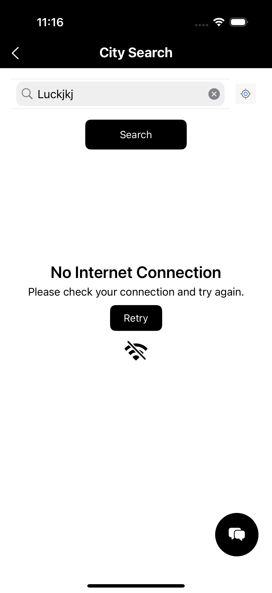

# City Search App

Welcome to the City Search App! This application allows users to search for cities and view relevant information about them. It features a modern user interface with animations and a seamless user experience.

## Features

- Search for cities by name.
- View detailed information about selected cities.
- User-friendly interface with animations.
- Offline handling with no internet connection banner.

## Screenshots

### Gallery

|  |  |  |
|-------------------------------------|-------------------------------------|-------------------------------------|
|  |  |  |
|  |  

## Requirements

- iOS 12.0 or later
- Xcode 12.0 or later

## Installation

1. Clone the repository:
   ```bash
   git clone https://github.com/Mohitmotive/city-search-app.git
   cd city-search-app
   ```

2. Install CocoaPods if you haven't already:
   ```bash
   sudo gem install cocoapods
   ```

3. Install the dependencies:
   ```bash
   pod install
   ```

4. Open the `.xcworkspace` file in Xcode:
   ```bash
   open CitySearch.xcworkspace
   ```

## Usage

1. Run the app on a simulator or a physical device.
2. On the welcome screen, tap "Start Searching" to navigate to the search screen.
3. Enter a city name in the search bar and view the results.

